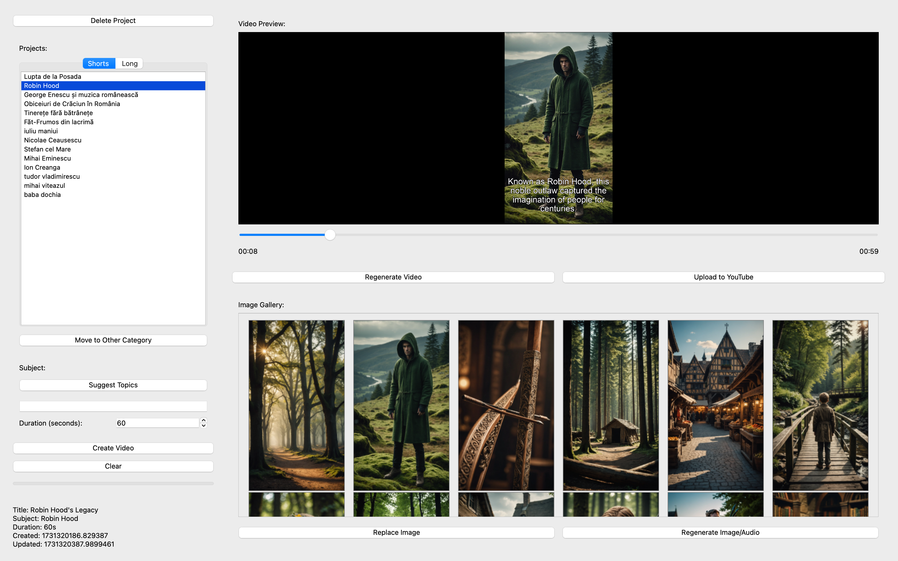
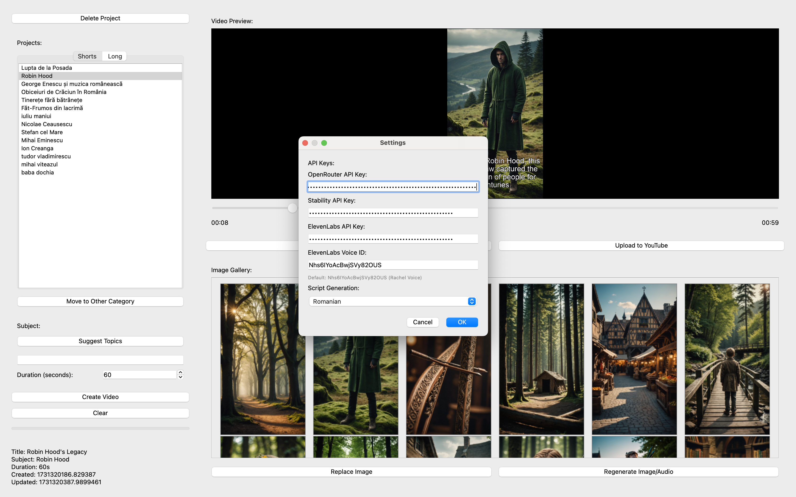
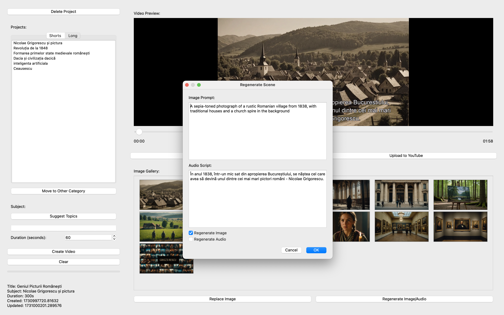

# VideoForge AI

A Python application that generates AI-powered video content using multiple AI services and FFmpeg for video processing. Perfect for creating both short-form and long-form content with minimal human intervention.

## Features

- Modern PyQt6 GUI interface with dedicated tabs for shorts and long videos
- Automated video creation optimized for both vertical shorts (≤60s) and horizontal long-form videos
- Project category management (easily move between shorts and long-form)
- Smart scene regeneration system
- Embedded video preview with image gallery
- AI-powered content generation:
  - Image generation via Stability AI
  - Audio generation via ElevenLabs (with customizable voice selection)
  - Script generation via Claude AI (supports Romanian and English)
- Advanced video processing with FFmpeg:
  - Automated aspect ratio handling
  - Smart audio silence removal
  - Background music integration
  - Seamless scene transitions
- Configurable settings:
  - API key management
  - Voice selection for ElevenLabs
  - Script language selection (Romanian/English)

## Examples

Check out these examples of content created with this tool:

- Live Channel: [Istorie Mistere](https://www.youtube.com/@IstorieMistere) - A history channel fully automated with VideoForge AI
- Example Video: [Mystery Short](https://www.youtube.com/shorts/jN07XEPQun8)

## Screenshots

> Note: These screenshots are from the latest version (0.1.0)


*Main application interface showing project management and video preview*


*API configuration and voice selection settings*


*AI-powered scene regeneration with prompt editing*

## Prerequisites

- Python 3.8 or higher
- FFmpeg installed and available in system PATH
- Google Chrome browser installed
- API keys for:
  - OpenRouter (Claude AI)
  - Stability AI
  - ElevenLabs

## Installation

1. Clone the repository:
```bash
git clone https://github.com/emanuel-mazilu/videoforgeai.git
cd videoforgeai
```

2. Create a virtual environment and activate it:
```bash
python -m venv venv
source venv/bin/activate  # On Windows: venv\Scripts\activate
```

3. Install dependencies:
```bash
pip install -r requirements.txt
```

4. Create a `.env` file in the project root with your API keys:
```
OPENROUTER_API_KEY=your_openrouter_api_key
STABILITY_API_KEY=your_stability_api_key
ELEVENLABS_API_KEY=your_elevenlabs_api_key
```

## Usage

1. Start the application:
```bash
python main.py
```

2. Create a new project:
   - Enter the subject and duration
   - Click "Create Video"

3. The application will:
   - Generate a script using Claude AI
   - Create images using Stability AI
   - Generate audio using ElevenLabs
   - Combine everything into a final video using FFmpeg
   - Upload the video to YouTube using Selenium with undetected-chromedriver

4. Use the interface to:
   - Preview generated content
   - Replace or regenerate images
   - Regenerate the entire video
   - Manage multiple projects

## Project Structure

```
project/
├── assets/
│   └── prompts/         # AI prompt templates
├── audio/
│   └── generator.py     # Audio generation using ElevenLabs API
├── image/
│   └── generator.py     # Image generation using Stability AI
├── script/
│   └── generator.py     # Script generation using Claude AI
├── video/
│   ├── creator.py       # Video creation orchestration
│   └── combiner.py      # Video compilation using ffmpeg
├── gui/
│   └── gui.py          # Main GUI implementation
├── project/
│   └── project.py      # Project management
└── main.py             # Application entry point
```

## License

See the [LICENSE](LICENSE) file for license rights and limitations.
